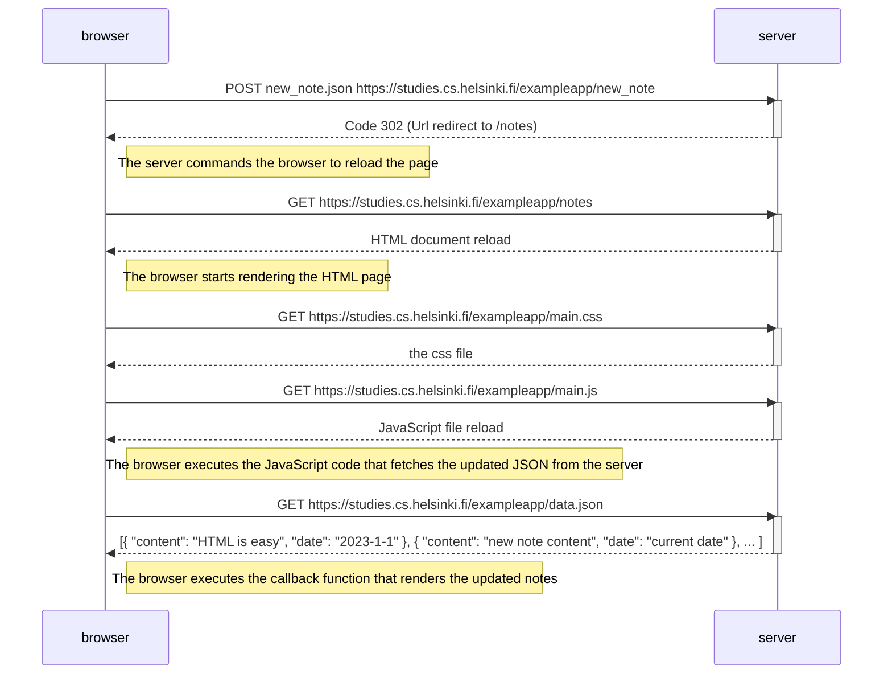

```mermaid
sequenceDiagram
    participant browser 
    participant server 


    browser->>server: POST new_note.json https://studies.cs.helsinki.fi/exampleapp/new_note
    activate server
    server-->>browser: Code 302 (Url redirect to /notes)
    deactivate server

    Note right of browser: The server commands the browser to reload the page

    browser->>server: GET https://studies.cs.helsinki.fi/exampleapp/notes
    activate server
    server-->>browser: HTML document reload
    deactivate server

    Note right of browser: The browser starts rendering the HTML page

    browser->>server: GET https://studies.cs.helsinki.fi/exampleapp/main.css
    activate server
    server-->>browser: the css file
    deactivate server

    browser->>server: GET https://studies.cs.helsinki.fi/exampleapp/main.js
    activate server
    server-->>browser: JavaScript file reload
    deactivate server

    Note right of browser: The browser executes the JavaScript code that fetches the updated JSON from the server

    browser->>server: GET https://studies.cs.helsinki.fi/exampleapp/data.json
    activate server
    server-->>browser: [{ "content": "HTML is easy", "date": "2023-1-1" }, { "content": "new note content", "date": "current date" }, ... ]
    deactivate server

    Note right of browser: The browser executes the callback function that renders the updated notes
```