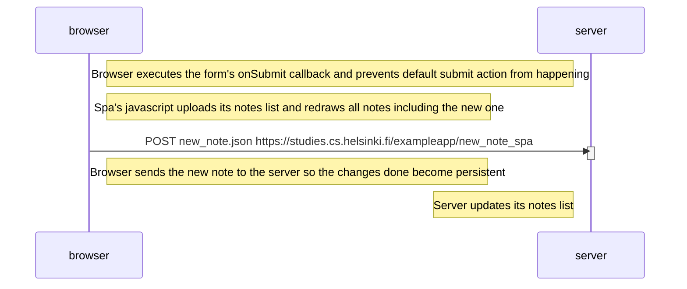

```mermaid
sequenceDiagram
    participant browser
    participant server

    Note right of browser: Browser executes the form's onSubmit callback and prevents default submit action from happening

    Note right of browser: Spa's javascript uploads its notes list and redraws all notes including the new one

    browser->>server: POST new_note.json https://studies.cs.helsinki.fi/exampleapp/new_note_spa
    activate server
    deactivate server

    Note right of browser:Browser sends the new note to the server so the changes done become persistent

    Note left of server: Server updates its notes list

```